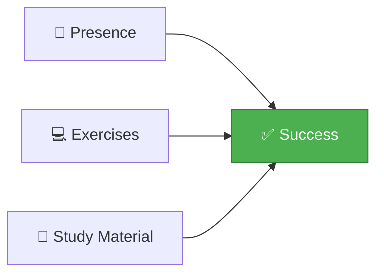

# 🎓 Course Introduction

## 👨‍🏫 Lecturers

<div style="background: linear-gradient(135deg, #667eea 0%, #764ba2 100%); padding: 20px; border-radius: 10px; color: white;">

**Dirk Hostens**  
📧 dirk.hostens@vives.be

**Milan Dima**  
📧 milan.dima@vives.be

</div>

---

## 📋 Ground Rules

### 📊 Grading

```
💯 100% Project + Oral Defense Exam
```

> 📌 **Important:** See Toledo for detailed information about practical organization

---

### ❓ Questions & Communication

<table>
<tr>
<td style="background-color: #e3f2fd; padding: 15px; border-radius: 5px;">

**📚 Course & Practical Questions**
- Use the **Forum on Toledo**
- Help each other learn!

</td>
<td style="background-color: #fff3e0; padding: 15px; border-radius: 5px;">

**🔒 Private Matters**
- Email or Teams
- Direct communication with lecturers

</td>
</tr>
</table>

---

### 💡 Best Preparation



> 🎯 **Key to Success:** Regular attendance + Active practice = Mastery!

---

## 🔄 Git Recap

<div style="background-color: #f5f5f5; padding: 20px; border-left: 4px solid #ff6b6b; border-radius: 5px;">

### Essential Git Commands

```bash
# Initialize a new repository
git init

# Connect to remote repository
git remote add origin [URL]

# Stage all changes
git add .

# Commit your changes
git commit -m 'eerste commit'

# Push to main branch
git push origin main
```

> ⚠️ **Note:** Some repositories still use `master` instead of `main`

</div>

---

### 🎓 GitHub Classroom

We'll be using **GitHub Classroom** for assignments and labs throughout this course.

```
📦 Assignment Distribution → GitHub Classroom
✅ Automatic Setup → Ready to Code
🔄 Version Control → Track Your Progress
```

---

## 🚀 Ready to Start?

Now that you know the basics, let's dive into **Node.js**!

> 💪 **Remember:** Practice makes perfect. Don't hesitate to ask questions on the forum!

---

<div style="text-align: center; padding: 20px; color: #666;">

[🏠 Course Home](../README.md) | [📘 Chapter 1 Home](./README.md) | [Next: What is Node.js →](./02-what-is-nodejs.md)

</div>

