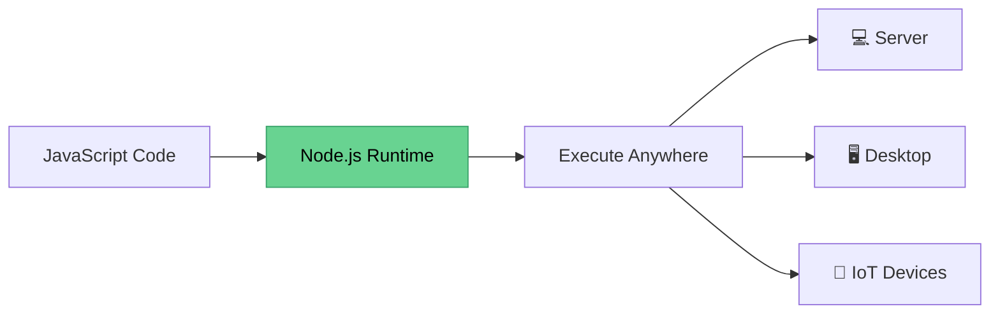

# 🟢 What is Node.js?

<div style="background: linear-gradient(135deg, #11998e 0%, #38ef7d 100%); padding: 30px; border-radius: 15px; color: white; text-align: center;">

## Node.js

**A runtime environment for executing JavaScript code**

✅ Open Source | 🌍 Cross-platform | ⚡ Runtime Environment

</div>

---

## 🎯 The Core Concept

### Running JavaScript Outside the Browser



> 🔑 **Key Point:** Node.js allows you to run JavaScript (or TypeScript) **outside the browser**

---

## 🏗️ What is it Used For?

### Back-end Services & APIs

<table style="width: 100%; border-collapse: collapse;">
<tr>
<td style="background-color: #e3f2fd; padding: 20px; text-align: center; border-radius: 10px;">

**📱 Web App**

↓

</td>
<td style="background-color: #fff3e0; padding: 20px; text-align: center; border-radius: 10px;">

**⚙️ Back-end Service**  
_(API - Application Programming Interface)_

</td>
<td style="background-color: #f3e5f5; padding: 20px; text-align: center; border-radius: 10px;">

↑

**📲 Mobile App**

</td>
</tr>
</table>

---

## ⭐ Ideal For

<div style="background-color: #f0f9ff; padding: 25px; border-radius: 10px; border: 2px solid #3b82f6;">

### 🚀 Highly-scalable Applications

- Handle thousands of concurrent connections
- Efficient resource usage

### 📊 Data-intensive Applications

- Real-time data processing
- High I/O operations

### ⚡ Real-time Applications

- Chat applications
- Live notifications
- Collaborative tools

### 🏃 Agile Development

- Great for prototyping
- Rapid development cycles

</div>

---

## 🏢 Used in Production By

<div style="display: grid; grid-template-columns: repeat(3, 1fr); gap: 15px; margin: 20px 0;">

<div style="background: linear-gradient(135deg, #667eea 0%, #764ba2 100%); padding: 20px; border-radius: 10px; color: white; text-align: center;">
💳 <strong>PayPal</strong>
</div>

<div style="background: linear-gradient(135deg, #f093fb 0%, #f5576c 100%); padding: 20px; border-radius: 10px; color: white; text-align: center;">
🎬 <strong>Netflix</strong>
</div>

<div style="background: linear-gradient(135deg, #4facfe 0%, #00f2fe 100%); padding: 20px; border-radius: 10px; color: white; text-align: center;">
🚗 <strong>Uber</strong>
</div>

<div style="background: linear-gradient(135deg, #43e97b 0%, #38f9d7 100%); padding: 20px; border-radius: 10px; color: white; text-align: center;">
💼 <strong>LinkedIn</strong>
</div>

<div style="background: linear-gradient(135deg, #fa709a 0%, #fee140 100%); padding: 20px; border-radius: 10px; color: white; text-align: center;">
🚀 <strong>NASA</strong>
</div>

<div style="background: linear-gradient(135deg, #30cfd0 0%, #330867 100%); padding: 20px; border-radius: 10px; color: white; text-align: center;">
🛒 <strong>eBay</strong>
</div>

</div>

> And many more: Groupon, Mozilla, Aliexpress...

📚 **Sources:**

- [trio.dev/blog/companies-use-node-js](https://trio.dev/blog/companies-use-node-js)
- [simform.com/blog/companies-using-nodejs](https://www.simform.com/blog/companies-using-nodejs/)

---

## 📊 StackOverflow Developer Survey 2025

<div style="background-color: #fff4e6; padding: 20px; border-radius: 10px; border-left: 5px solid #ff9800;">

Node.js consistently ranks as one of the **most popular technologies** among professional developers!

🔗 [See the full survey](https://survey.stackoverflow.co/2025/technology/#1-web-frameworks-and-technologies)

</div>

---

## 💰 Case Study: PayPal

<div style="background: linear-gradient(to right, #0070ba, #003087); padding: 25px; border-radius: 15px; color: white;">

### Java Spring Application → Node.js Migration

**Results:**

- ✅ Built in **less time** with **fewer developers**
- 🚀 **35% decrease** in average response time
- ⚡ **2x faster** page serving
- 📉 **Reduced codebase** - easier to maintain

</div>

> 📖 **Source:** [engineerbabu.com/blog/node-js-the-rising-technology-behind-paypal](https://engineerbabu.com/blog/node-js-the-rising-technology-behind-paypal/)

---

## 🎯 Key Points

```
✅ Great for prototyping and agile development
✅ Super fast and highly scalable
✅ JavaScript everywhere (front-end + back-end)
✅ Cleaner and more consistent codebase
✅ Large ecosystem of open-source libraries
```

<div style="background-color: #e8f5e9; padding: 20px; border-radius: 10px; margin-top: 20px;">

### 🎨 JavaScript Everywhere

Use the **same language** for:

- 🎨 Front-end (React, Vue, Angular)
- ⚙️ Back-end (Node.js)
- 📱 Mobile (React Native)
- 🖥️ Desktop (Electron)

**Result:** More consistent code, easier team collaboration!

</div>

---

## 🤔 What's Next?

Now that you understand what Node.js is and why it's powerful, let's explore **how it actually works** under the hood!

---

<div style="text-align: center; padding: 20px; color: #666;">

[🏠 Course Home](../README.md) | [📘 Chapter 1 Home](./README.md)

[← Previous: Course Introduction](./01-course-introduction.md) | [Next: Node.js Architecture →](./03-nodejs-architecture.md)

</div>
