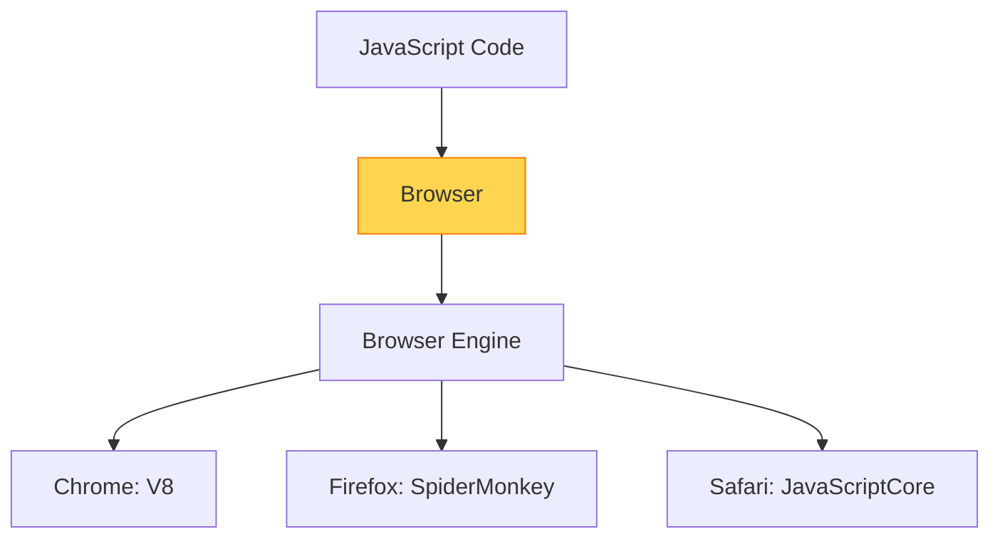
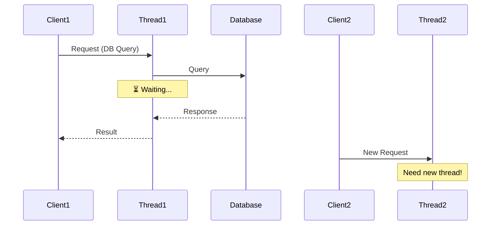
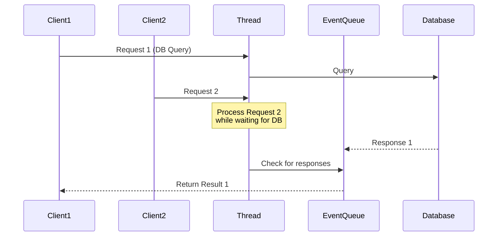
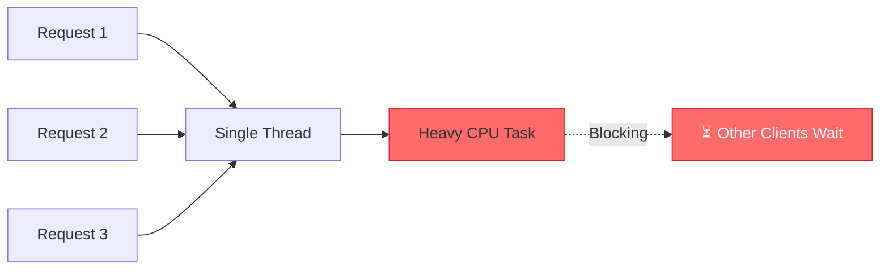

# ⚙️ Node.js Architecture & How It Works

## 🕰️ Before Node.js (Pre-2009)

<div style="background-color: #fff3e0; padding: 25px; border-radius: 10px; border-left: 5px solid #ff9800;">

### JavaScript in the Browser

JavaScript was **only** meant to run inside web browsers.



**Different browsers = Different JavaScript engines!**

### Browser-Specific Objects

```javascript
// Only available in browsers
document.getElementById('myElement');
window.location.href;
console.log(window);
```

</div>

---

## 🎉 2009: Ryan Dahl's Revolution

<div style="background: linear-gradient(135deg, #667eea 0%, #764ba2 100%); padding: 30px; border-radius: 15px; color: white;">

### The Birth of Node.js

Ryan Dahl embedded **Chrome's V8 JavaScript Engine** into a **C++ program**

```
V8 Engine (JavaScript) + C++ Program = Node.js
```

**Result:** JavaScript can now run **anywhere**! 🚀

</div>

---

## 🏗️ Node.js vs Browser

### Different Objects, Same Language

<table style="width: 100%;">
<tr style="background-color: #e3f2fd;">
<th style="padding: 15px;">🌐 Browser</th>
<th style="padding: 15px;">🟢 Node.js</th>
</tr>
<tr>
<td style="padding: 15px; background-color: #f5f5f5;">

```javascript
// Browser-specific
document.getElementById('id');
window.location;
```

</td>
<td style="padding: 15px; background-color: #f5f5f5;">

```javascript
// Node-specific
fs.readFile('file.txt');
http.createServer();
```

</td>
</tr>
</table>

---

## 📦 What is Node.js?

<div style="background-color: #e8f5e9; padding: 25px; border-radius: 10px; border: 2px solid #4caf50;">

### Architecture Components

```
Node.js = V8 JavaScript Engine + Additional Modules
```

**Additional Modules Include:**
- 📁 File System (fs)
- 🌐 Networking (http, https)
- 🔐 Cryptography
- 🗜️ Compression
- 🎯 Much more...

</div>

> ⚠️ **Important:** Node.js is **NOT a framework**!  
> It's different from ASP.NET, Rails, or Django.

---

## 🚀 How Does Node Work?

### Core Characteristics

<div style="display: grid; grid-template-columns: repeat(2, 1fr); gap: 20px; margin: 20px 0;">

<div style="background-color: #e3f2fd; padding: 20px; border-radius: 10px;">

**📈 Very Scalable**
Handle thousands of connections efficiently

</div>

<div style="background-color: #f3e5f5; padding: 20px; border-radius: 10px;">

**⚡ Real-time**
Perfect for live applications

</div>

<div style="background-color: #fff3e0; padding: 20px; border-radius: 10px;">

**🔄 Non-blocking**
Asynchronous by nature

</div>

<div style="background-color: #e8f5e9; padding: 20px; border-radius: 10px;">

**💛 JavaScript**
Use the language you know

</div>

</div>

---

## 🔄 Synchronous vs Asynchronous

### ❌ Synchronous (Traditional Approach)

<div style="background-color: #ffebee; padding: 20px; border-radius: 10px; border-left: 5px solid #f44336;">



**Problems:**
- ❌ Each request needs a new thread
- ❌ Threads wait idly during I/O operations
- ❌ With many clients, threads get exhausted
- ❌ Need to deploy more hardware
- 💰 **Expensive to scale**

**Example:** Default ASP.NET behavior

</div>

---

### ✅ Asynchronous (Node.js Approach)

<div style="background-color: #e8f5e9; padding: 20px; border-radius: 10px; border-left: 5px solid #4caf50;">



**Benefits:**
- ✅ **Single thread** handles all requests
- ✅ No waiting during I/O operations
- ✅ **Event Queue** manages responses
- ✅ Thread serves next request immediately
- 🚀 **Highly efficient**

</div>

---

## 🍽️ Restaurant Analogy

<div style="background-color: #f5f5f5; padding: 25px; border-radius: 10px;">

### Asynchronous (Node.js Way) ✅

```
🧑‍🍳 1 Waiter (Thread) → Multiple Tables

1. Takes order from Table 1
2. Sends order to kitchen
3. Immediately takes order from Table 2
4. Takes order from Table 3
5. Delivers ready orders as they come
```

**Efficient:** One waiter handles multiple tables!

---

### Synchronous (Traditional Way) ❌

```
🧑‍🍳 Waiter takes order from Table 1
⏳ Waits in kitchen until food is ready
🚶 Delivers food to Table 1
🔄 Only then takes order from Table 2
```

**Inefficient:** Need multiple waiters (threads)!

</div>

---

## ✅ Node.js is GOOD For

<div style="background: linear-gradient(135deg, #11998e 0%, #38ef7d 100%); padding: 25px; border-radius: 15px; color: white;">

### 📊 I/O Intensive Applications

Applications with **heavy disk or network access:**

- 🌐 Web APIs
- 💬 Chat applications
- 📊 Real-time analytics
- 📁 File processing
- 🔄 Data streaming
- 📡 Microservices

**Why?** Node.js doesn't block while waiting for I/O operations!

</div>

---

## ❌ Node.js is NOT Good For

<div style="background: linear-gradient(135deg, #ee0979 0%, #ff6a00 100%); padding: 25px; border-radius: 15px; color: white;">

### 🖥️ CPU Intensive Applications

Applications requiring **heavy calculations:**

- 🎬 Video encoding
- 🖼️ Image processing
- 🧮 Complex mathematical computations
- 🎨 3D rendering
- 🔐 Encryption/Decryption of large files

**Why?** Single thread gets blocked by heavy CPU operations!

</div>

---

### ⚠️ The Problem with CPU Intensive Tasks



> When the CPU is busy with intensive calculations, other clients must wait until the thread is free again!

---

## 🎯 Summary

<table style="width: 100%; border-collapse: collapse;">
<tr style="background-color: #e8f5e9;">
<th style="padding: 15px;">Concept</th>
<th style="padding: 15px;">Key Takeaway</th>
</tr>
<tr>
<td style="padding: 15px;">**Architecture**</td>
<td style="padding: 15px;">V8 Engine + C++ + Additional Modules</td>
</tr>
<tr style="background-color: #f5f5f5;">
<td style="padding: 15px;">**Threading**</td>
<td style="padding: 15px;">Single-threaded with Event Loop</td>
</tr>
<tr>
<td style="padding: 15px;">**Execution**</td>
<td style="padding: 15px;">Asynchronous & Non-blocking</td>
</tr>
<tr style="background-color: #f5f5f5;">
<td style="padding: 15px;">**Best For**</td>
<td style="padding: 15px;">I/O Intensive Applications</td>
</tr>
<tr>
<td style="padding: 15px;">**Avoid For**</td>
<td style="padding: 15px;">CPU Intensive Applications</td>
</tr>
</table>

---

## 🔜 Next Steps

Now that you understand the architecture, let's get Node.js **installed and running** on your machine!

---

<div style="text-align: center; padding: 20px; color: #666;">

[🏠 Course Home](../README.md) | [📘 Chapter 1 Home](./README.md)

[← Previous: What is Node.js](./02-what-is-nodejs.md) | [Next: Installation & Setup →](./04-installation-setup.md)

</div>

