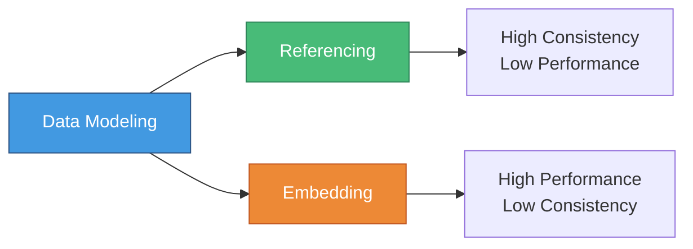
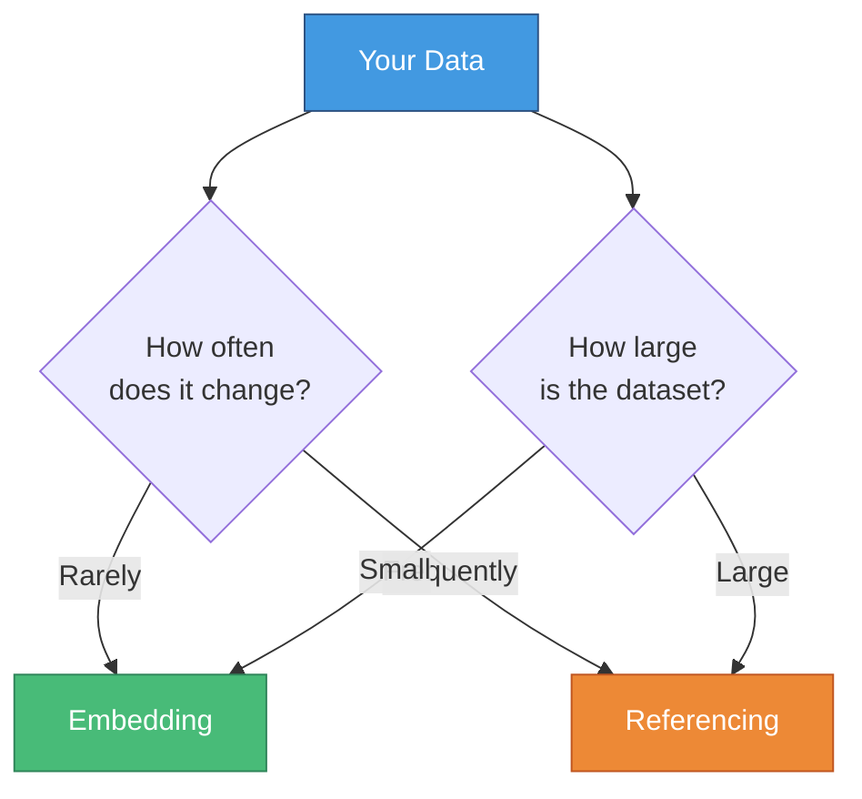

# 🗂️ Mongoose Modeling

> **Chapter 9: Data Modeling Strategies in MongoDB**

---

## 📋 Overview

In this chapter, we'll explore **data modeling strategies** in MongoDB using Mongoose:

- 🔗 **Referencing vs Embedding**
- 🎯 **When to use each approach**
- 🔄 **Hybrid approaches**
- 📊 **Working with subdocuments**
- 🆔 **Understanding MongoDB ObjectIDs**

---

## 🎯 Key Concepts

### The Trade-Off

---

## ⚠️ Important Considerations

> **Note:** In NoSQL databases like MongoDB, there's **no automatic data integrity** through relationships!

### Key Points to Remember:

- ❌ References are **not automatically updated**
- 🔍 With **Referencing**: More queries needed to fetch related data
- ⚡ With **Embedding**: Single query but more data duplication
- 🔄 Updates with embedding require changes in multiple places

---

## 📊 When to Use What?

### 🎯 Decision Guide

| Relationship Type | Recommended Approach | Reason |
|------------------|---------------------|---------|
| **1 : Few** | 📦 Embedding | Small, contained data |
| **1 : Many** (read-heavy) | 📦 Embedding | Fast reads, minimal updates |
| **1 : Many** (write-heavy) | 🔗 Referencing | Data changes frequently |
| **1 : Ton** | 🔗 Referencing | Massive collections |
| **Many : Many** | 🔗 Referencing | Complex relationships |

---

## 🔄 The Balance

### Performance vs Consistency

---

## 💡 What's Next?

In the following sections, we'll dive deep into:
- Implementing **referencing** with population
- Working with **embedded documents**
- Creating **hybrid** approaches
- Managing **arrays of subdocuments**

---

[🏠 Home](../README.md) | [Next: Referencing vs Embedding →](02-referencing-embedding.md)
