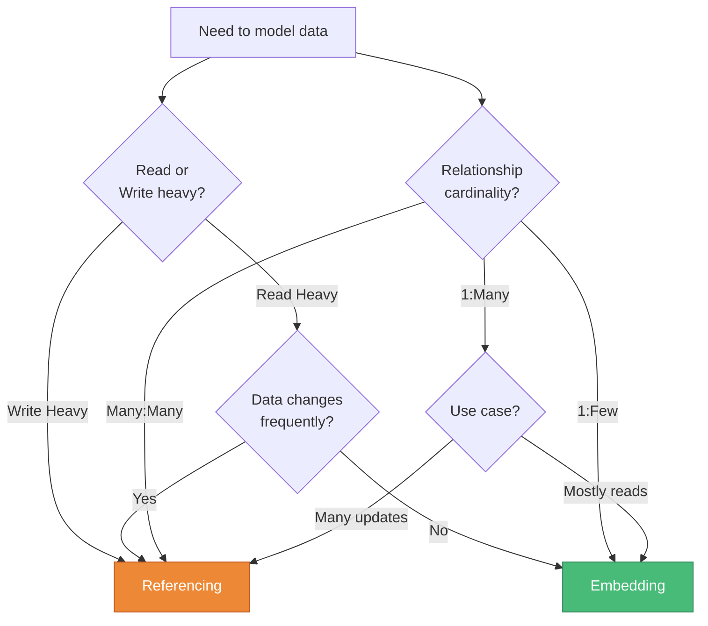

# 🔗 Referencing & Embedding

> **Understanding the two main data modeling approaches**

---

## 📊 The Two Approaches

### 🔗 Referencing (Normalization)

**✅ HIGH Consistency | ❌ LOW Performance**

```javascript
// Author stored separately
let author = {
  _id: 'author123',
  name: 'Vives'
}

// Course references the author by ID
let course = {
  name: 'Node.js Course',
  author: 'author123'  // Reference to author
}
```

**Characteristics:**
- 📌 Data stored in separate collections
- 🔄 Single source of truth
- 🔍 Requires multiple queries to get complete data
- ✨ Updates happen in one place

---

### 📦 Embedding Documents (Denormalization)

**✅ HIGH Performance | ❌ LOW Consistency**

```javascript
// Author embedded within course
let course = {
  name: 'Node.js Course',
  author: {
    name: 'Vives'
  }
}
```

**Characteristics:**
- ⚡ Single query retrieves all data
- 💾 Data duplicated across documents
- 🔄 Updates must happen in multiple places
- 🚀 Faster read operations

---

## 🎭 Visual Comparison


---

## 🔄 Trade-Off Analysis

### Referencing Advantages

| ✅ Pros | ❌ Cons |
|---------|---------|
| Data consistency | Multiple queries needed |
| Single source of truth | Slower read operations |
| Easy updates | More complex queries |
| Less storage used | Requires JOIN operations |

### Embedding Advantages

| ✅ Pros | ❌ Cons |
|---------|---------|
| Fast queries | Data duplication |
| Single query reads | Update complexity |
| Better performance | Consistency challenges |
| Simpler code | Larger documents |

---

## 🤔 Decision Matrix



---

## 💡 Example Use Cases

### 🔗 Use Referencing When:

```javascript
// User and their orders (can have thousands)
{
  user: { _id: '123', name: 'John' },
  orders: ['order1', 'order2', 'order3', ...] // References
}

// Blog posts and comments (unbounded growth)
{
  post: { _id: 'post1', title: 'My Post' },
  comments: ['comment1', 'comment2', ...] // References
}
```

### 📦 Use Embedding When:

```javascript
// User profile with address (limited, rarely changes)
{
  user: {
    name: 'John',
    address: {
      street: '123 Main St',
      city: 'Brussels'
    }
  }
}

// Product with specifications (fixed structure)
{
  product: {
    name: 'Laptop',
    specs: {
      cpu: 'i7',
      ram: '16GB',
      storage: '512GB SSD'
    }
  }
}
```

---

[← Previous: Introduction](01-intro.md) | [🏠 Home](../README.md) | [Next: Hybrid Approach →](03-hybrid-approach.md)
