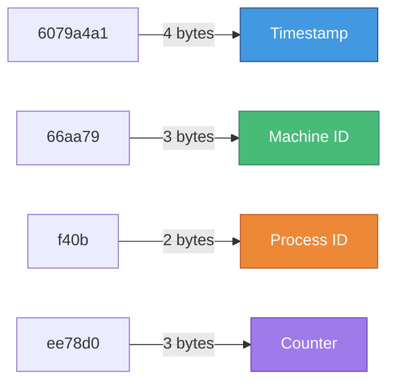
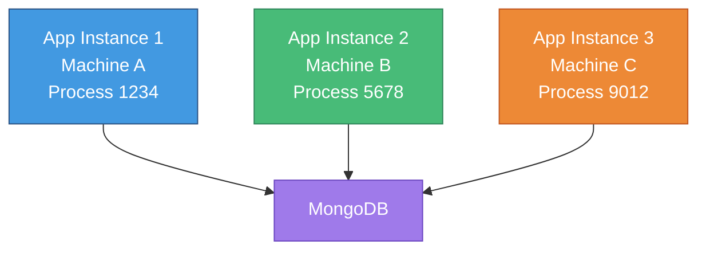
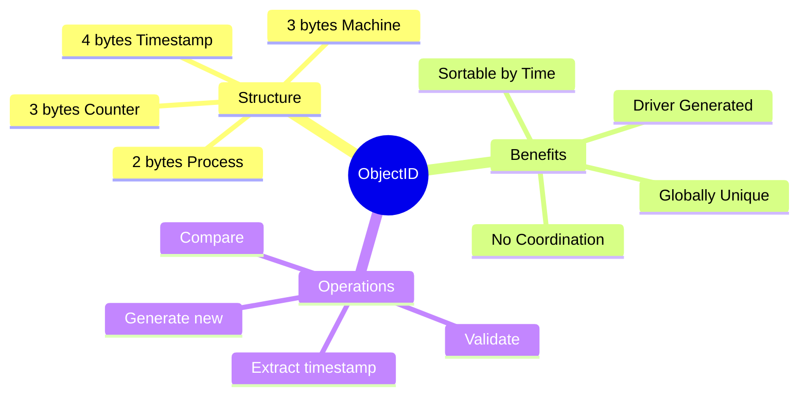

# 🆔 MongoDB ObjectIDs

> **Understanding MongoDB's unique identifier system**

---

## 🎯 What is an ObjectID?

Every document stored in MongoDB gets a **unique identifier** called an **ObjectID**.

### Format

```
6079a4a166aa79f40bee78d0
```

- 📏 **Length:** 24 hexadecimal characters
- 💾 **Size:** 12 bytes
- 🔐 **Uniqueness:** Globally unique

---

## 🏗️ ObjectID Structure

### The Anatomy of an ObjectID



---

## 📊 Breaking Down the Components

| Component | Bytes | Example | Purpose |
|-----------|-------|---------|---------|
| **Timestamp** | 4 | `6079a4a1` | Creation time (seconds since epoch) |
| **Machine ID** | 3 | `66aa79` | Identifier of the machine |
| **Process ID** | 2 | `f40b` | Identifier of the MongoDB process |
| **Counter** | 3 | `ee78d0` | Incrementing counter (up to 16M) |

---

## ⏰ Timestamp Component

### Sorting by ID = Sorting by Creation Time

```javascript
// ObjectIDs naturally sort by creation time
db.collection.find().sort({ _id: 1 })  // Oldest first
db.collection.find().sort({ _id: -1 }) // Newest first
```

**Why?** The first 4 bytes contain the timestamp!

---

## 🖥️ Machine & Process IDs

### Distributed System Support



Each instance generates unique IDs without coordination!

---

## 🔢 Counter Component

### Handling High Volume

- 🎯 **Range:** 0 to 16,777,215 (2^24)
- ⚡ **Speed:** Can generate 16M IDs per second per process
- 🔄 **Reset:** Increments with each new ID

---

## 🚀 Why This Matters: Scalability

### Driver-Side Generation

```mermaid
sequenceDiagram
    participant App
    participant Driver
    participant MongoDB
    
    App->>Driver: Create document
    Driver->>Driver: Generate ObjectID
    Driver->>MongoDB: Insert with ID
    MongoDB-->>Driver: Success
    Driver-->>App: Return with ID
    
    style Driver fill:#4299e1,stroke:#2c5282,color:#fff
    style MongoDB fill:#48bb78,stroke:#2f855a,color:#fff
```

**Key Point:** IDs are generated by the **MongoDB driver**, not the database!

---

## 💡 Benefits of Driver-Side Generation

| Benefit | Impact |
|---------|--------|
| 🚀 **No DB roundtrip** | Faster insertions |
| 📈 **Scalable** | Multiple instances work independently |
| 🔒 **No conflicts** | Globally unique without coordination |
| ⚡ **High throughput** | Can handle millions of inserts |

---

## 🛠️ Working with ObjectIDs

### Generate a New ObjectID

```javascript
const mongoose = require('mongoose');

const id = new mongoose.Types.ObjectId();
console.log(id);
```

**Output:**
```
6079b1b772f86ef6a42b7c37
```

---

### Extract Timestamp

```javascript
const mongoose = require('mongoose');

const id = new mongoose.Types.ObjectId();
console.log(id.getTimestamp());
```

**Output:**
```
2021-04-16T15:50:21.000Z
```

---

### Validate ObjectID

```javascript
const mongoose = require('mongoose');

const id = new mongoose.Types.ObjectId();
const isValid = mongoose.Types.ObjectId.isValid(id);
console.log(isValid);  // true

const isValid2 = mongoose.Types.ObjectId.isValid('invalid');
console.log(isValid2);  // false
```

---

## 📝 Complete Example

```javascript
const mongoose = require('mongoose');

// Generate new ObjectID
const id = new mongoose.Types.ObjectId();
console.log('Generated ID:', id);
console.log('Timestamp:', id.getTimestamp());

// Validate IDs
console.log('Is valid ID:', mongoose.Types.ObjectId.isValid(id));
console.log('Is "123" valid:', mongoose.Types.ObjectId.isValid('123'));

// Convert string to ObjectID
const stringId = '6079b1b772f86ef6a42b7c37';
const objectId = new mongoose.Types.ObjectId(stringId);
console.log('Converted:', objectId);

// Compare IDs
const id1 = new mongoose.Types.ObjectId();
const id2 = new mongoose.Types.ObjectId();
console.log('IDs equal:', id1.equals(id2));  // false
console.log('ID equals itself:', id1.equals(id1));  // true
```

---

## 🎯 Practical Use Cases

### 1️⃣ Check Document Age

```javascript
const doc = await Model.findById(someId);
const createdAt = doc._id.getTimestamp();
const age = Date.now() - createdAt.getTime();
console.log(`Document is ${age}ms old`);
```

---

### 2️⃣ Sort by Creation Time

```javascript
// Sort by ID = Sort by creation time
const docs = await Model
  .find()
  .sort({ _id: -1 })  // Newest first
  .limit(10);
```

---

### 3️⃣ Validate User Input

```javascript
app.get('/courses/:id', async (req, res) => {
  // Validate ID before querying
  if (!mongoose.Types.ObjectId.isValid(req.params.id)) {
    return res.status(400).send('Invalid ID');
  }
  
  const course = await Course.findById(req.params.id);
  // ...
});
```

---

### 4️⃣ Pre-generate IDs

```javascript
// Generate ID before saving
const course = new Course({
  _id: new mongoose.Types.ObjectId(),  // Explicit ID
  name: 'Node.js Course'
});

console.log('Will save with ID:', course._id);
await course.save();
```

---

## 🔍 ObjectID vs UUID

| Aspect | ObjectID | UUID |
|--------|----------|------|
| **Size** | 12 bytes | 16 bytes |
| **String Length** | 24 chars | 36 chars |
| **Timestamp** | ✅ Embedded | ❌ No |
| **Sortable** | ✅ Yes | ❌ No (v4) |
| **Collision** | Extremely rare | Extremely rare |
| **MongoDB Native** | ✅ Yes | ❌ No |

---

## 💭 Common Questions

### Q: Can I use my own IDs?

**A:** Yes! You can specify `_id` when creating documents:

```javascript
const course = new Course({
  _id: 'my-custom-id',  // ✅ Allowed
  name: 'Node.js Course'
});
```

---

### Q: Should I use ObjectIDs or auto-increment?

**A:** ObjectIDs are better for distributed systems:

| ObjectID | Auto-increment |
|----------|----------------|
| ✅ No coordination needed | ❌ Requires central counter |
| ✅ Works across servers | ❌ Single point of failure |
| ✅ Globally unique | ⚠️ Only unique per collection |
| ✅ Contains timestamp | ❌ No metadata |

---

### Q: Can I decode an ObjectID?

**A:** Partially - you can extract the timestamp:

```javascript
const id = new mongoose.Types.ObjectId('6079b1b772f86ef6a42b7c37');
console.log(id.getTimestamp());
// 2021-04-16T15:50:21.000Z
```

But machine/process IDs and counter are not easily accessible.

---

## 🎨 Visual Summary



---

## 💡 Key Takeaways

| Concept | Detail |
|---------|--------|
| 🆔 **Format** | 24 hex characters = 12 bytes |
| ⏰ **Timestamp** | First 4 bytes, creation time |
| 🖥️ **Machine+Process** | Next 5 bytes, for distribution |
| 🔢 **Counter** | Last 3 bytes, up to 16M/sec |
| 🚀 **Generated** | By driver, not database |
| 📈 **Scalable** | Perfect for distributed systems |

---

[← Previous: Arrays of Subdocuments](06-arrays-subdocuments.md) | [🏠 Home](../README.md) | [Next: Transactions →](08-transactions.md)
