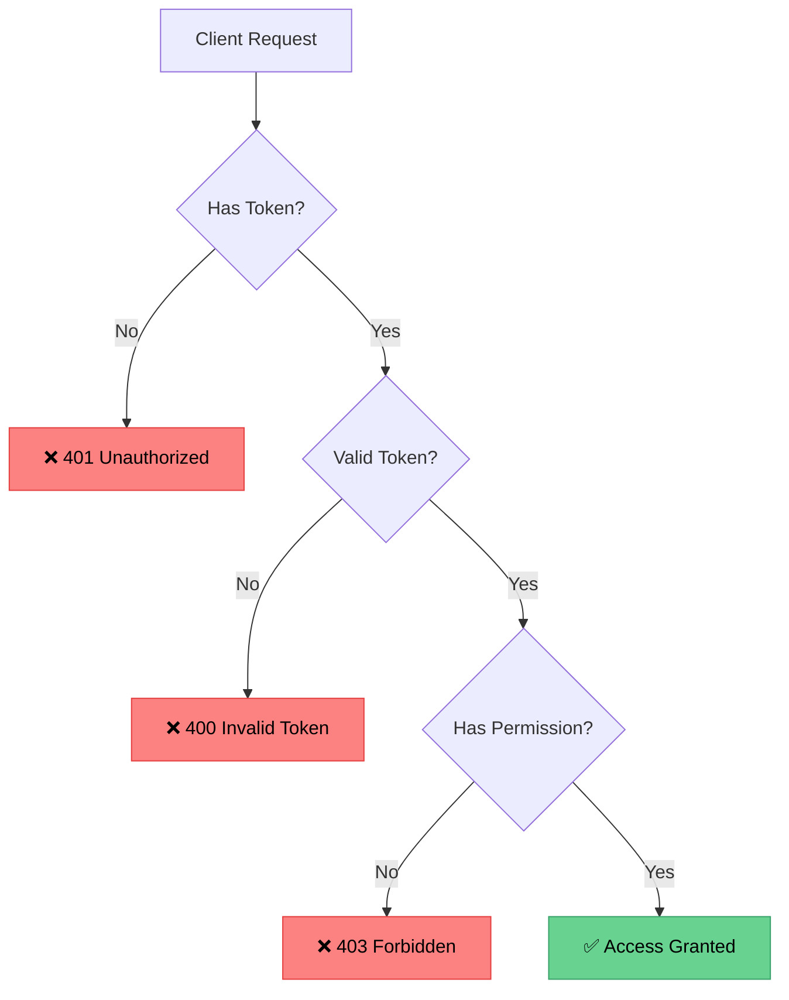

# 🔐 Chapter 10: Authorization & Authentication

## Introduction to Auth

> **Authentication** vs **Authorization**
> 
> 🔑 **Authentication**: Who are you?
> 
> 🚪 **Authorization**: What can you do?

---

### 📋 Topics Covered

- **Authentication with JWT** 🎫
- **Protecting Routes** 🛡️
- **Getting Current User** 👤
- **Role-Based Authorization** 👑
- **Admin Middleware** ⚡

---

### 🎯 Learning Objectives

By the end of this chapter, you will be able to:

- ✅ Implement JWT authentication
- ✅ Protect API routes with middleware
- ✅ Retrieve authenticated user information
- ✅ Implement role-based access control
- ✅ Create admin-only endpoints

---

### 🔑 Key Concepts

---

### 📦 Prerequisites

Make sure you have completed:
- ✅ Chapter 9 - Mongoose Modeling
- ✅ Understanding of Express middleware
- ✅ JWT basics from previous chapters

---

[🏠 Home](../README.md) | [Next: Auth Middleware →](02-auth-middleware.md)
