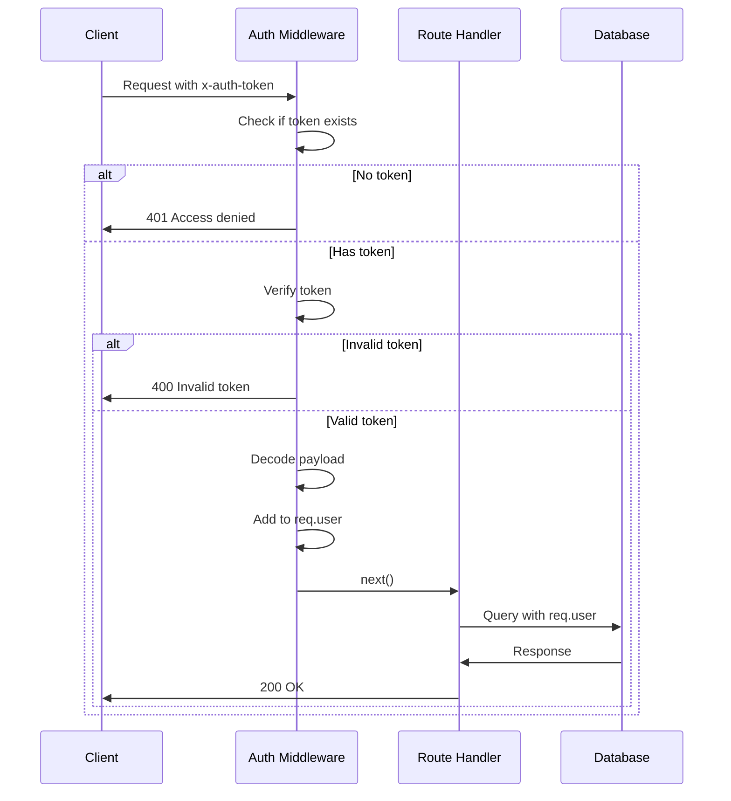

# 🛡️ Auth Middleware

## Protecting Routes with Authentication

Let's create middleware to verify JWT tokens and protect our routes.

---

### 📝 Creating Auth Middleware

Create a new file: `middleware/auth.js`

```javascript
const jwt = require('jsonwebtoken');
const config = require('config');

module.exports = function (req, res, next) {
  const token = req.header('x-auth-token');
  if (!token) return res.status(401).send('Access denied. No token provided.');

  try {
    const decoded = jwt.verify(token, config.get('jwtPrivateKey'));
    req.user = decoded;
    next();
  } catch (ex) {
    res.status(400).send('Invalid token.');
  }
}
```

---

### 🔍 How It Works



---

### 🎯 Key Points

- 🔑 **Token in Header**: Looks for `x-auth-token` in request headers
- ✅ **Verification**: Uses JWT secret to verify token validity
- 📦 **Decoded Payload**: Adds decoded user data to `req.user`
- ⚡ **Next Middleware**: Calls `next()` to continue to route handler

---

### 📊 HTTP Status Codes

| Status | Meaning | When Used |
|--------|---------|-----------|
| 🔴 **401** | Unauthorized | No token provided |
| 🔴 **400** | Bad Request | Invalid token |
| 🔴 **403** | Forbidden | Valid token, no permission |
| 🟢 **200** | OK | Success |

---

[← Previous: Introduction](01-intro.md) | [🏠 Home](../README.md) | [Next: Protecting Routes →](03-protecting-routes.md)
