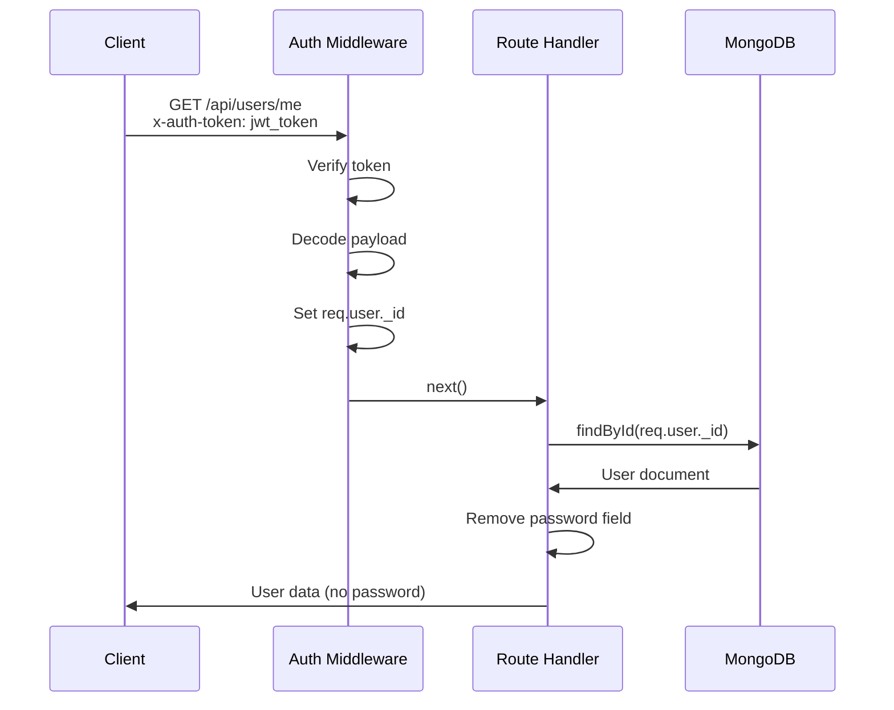
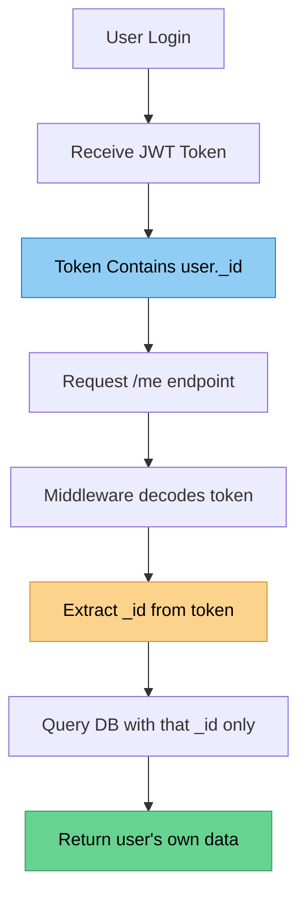

# 👤 Getting the Current User

## Retrieving Authenticated User Information

Let's create a secure endpoint to get the currently logged-in user's information.

---

### ⚠️ Security Issue

**Bad Approach:** ❌
```javascript
router.get('/:id', async (req, res) => {
  const user = await User.findById(req.params.id);
  res.send(user);
});
```

**Problem:** Users can access other users' information by changing the ID!

---

### ✅ Secure Approach

**Good Approach:** ✅
```javascript
const auth = require('../middleware/auth');

router.get('/me', auth, async (req, res) => {
  const user = await User.findById(req.user._id).select('-password');
  res.send(user);
});
```

---

### 🔍 How It Works



---

### 🎯 Key Security Features

1. **Token-Based ID** 🔑
   - Uses `req.user._id` from decoded token
   - User can only access their own data

2. **Password Exclusion** 🚫
   - `.select('-password')` removes password from response
   - Never send passwords to clients

3. **Auth Required** 🛡️
   - Must be authenticated to access
   - No token = no access

---

### 🧪 Testing in Postman

#### ❌ Test 1: No Token

**Request:**
```http
GET http://localhost:3000/api/users/me
```

**Response:** `401 Unauthorized`
```
Access denied. No token provided.
```

---

#### ❌ Test 2: Invalid Token

**Request:**
```http
GET http://localhost:3000/api/users/me
x-auth-token: 1234
```

**Response:** `400 Bad Request`
```
Invalid token.
```

---

#### ✅ Test 3: Valid Token

**Request:**
```http
GET http://localhost:3000/api/users/me
x-auth-token: eyJhbGciOiJIUzI1NiIsInR5cCI6IkpXVCJ9...
```

**Response:** `200 OK`
```json
{
  "_id": "609429731a37803084ef0adf",
  "name": "Vives",
  "email": "milan12@vives.be",
  "__v": 0
}
```

---

### 🧾 REST Client Example

```http
### Get Current User
GET {{base_URL}}/api/users/me
x-auth-token: {{auth_token}}
```

---

### 🔐 Why This Approach is Secure



**Key Point:** The user ID comes from the **verified token**, not from user input!

---

### 💡 Best Practices

- ✅ Always use token-based user identification
- ✅ Never trust user-provided IDs for sensitive data
- ✅ Always exclude sensitive fields (passwords, secrets)
- ✅ Use `.select('-password')` or similar methods
- ✅ Validate tokens before processing requests

---

[← Previous: Protecting Routes](03-protecting-routes.md) | [🏠 Home](../README.md) | [Next: User Logout →](05-user-logout.md)
