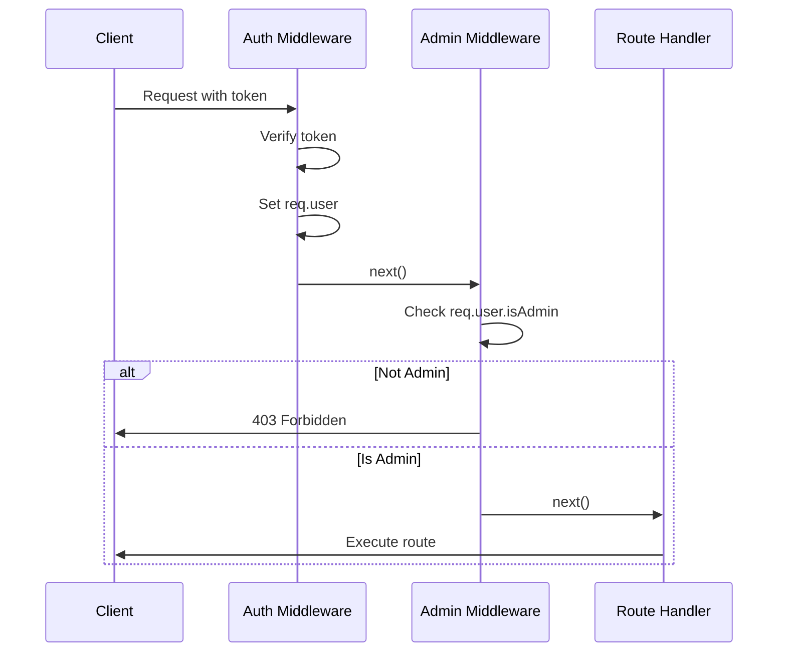
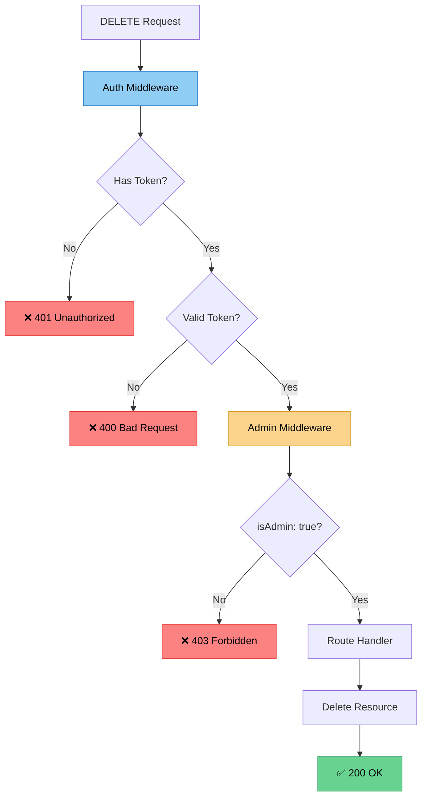

# ⚡ Admin Middleware

## Creating Authorization Middleware for Admins

Let's create middleware to check if a user has admin privileges.

---

### 📝 Creating Admin Middleware

Create a new file: `middleware/admin.js`

```javascript
// HTTP Status Codes:
// 400 Bad Request
// 401 Unauthorized - Not authenticated
// 403 Forbidden - Authenticated but no permission

module.exports = function (req, res, next) {
  if (!req.user.isAdmin) return res.status(403).send('Access Denied');
  next();
}
```

---

### 🔍 How It Works



---

### 🎯 Key Concept: Middleware Order

**Important:** Admin middleware must come **after** auth middleware!

```javascript
const auth = require('../middleware/auth');
const admin = require('../middleware/admin');

// ✅ Correct order: [auth, admin]
router.delete('/:id', [auth, admin], async (req, res) => {
  // Route handler
});

// ❌ Wrong order: [admin, auth]
// This won't work because req.user doesn't exist yet!
```

---

### 📊 HTTP Status Codes Explained

| Status | Name | Meaning | Use Case |
|--------|------|---------|----------|
| 🔴 **400** | Bad Request | Invalid data/token | Malformed request |
| 🔴 **401** | Unauthorized | Not authenticated | No token or invalid token |
| 🔴 **403** | Forbidden | No permission | Valid token but insufficient privileges |
| 🟢 **200** | OK | Success | Request successful |

---

### 🎨 Authorization Flow



---

### 💡 Why req.user Exists

The **auth middleware** creates `req.user`:

```javascript
// In auth.js
const decoded = jwt.verify(token, config.get('jwtPrivateKey'));
req.user = decoded; // ✅ Sets req.user

// Now admin.js can access it:
if (!req.user.isAdmin) // ✅ Works because auth ran first
```

**Decoded token contains:**
```json
{
  "_id": "609429731a37803084ef0adf",
  "isAdmin": true  // ← This is what we check
}
```

---

### 🔐 Security Benefits

- ✅ **Separation of Concerns**: Auth and authz are separate
- ✅ **Reusable**: Can apply to any route
- ✅ **Clear Errors**: Different status codes for different issues
- ✅ **No DB Query**: Role info is in the token

---

### 🎯 Middleware Composition

You can combine multiple middleware:

```javascript
const auth = require('../middleware/auth');
const admin = require('../middleware/admin');
const validateObjectId = require('../middleware/validateObjectId');

// Multiple middleware in array
router.delete('/:id', [auth, admin, validateObjectId], async (req, res) => {
  // Only executed if all middleware pass!
  const genre = await Genre.findByIdAndRemove(req.params.id);
  if (!genre) return res.status(404).send('Genre not found.');
  res.send(genre);
});
```

**Execution order:** auth → admin → validateObjectId → route handler

---

### 💡 Best Practices

- ✅ Always put `auth` before `admin` middleware
- ✅ Use descriptive error messages
- ✅ Return appropriate HTTP status codes
- ✅ Keep middleware functions small and focused
- ✅ Log admin actions for audit trails

---

### 📝 Summary

**Admin Middleware:**
- Checks `req.user.isAdmin` property
- Returns 403 if not admin
- Calls `next()` if admin
- Must run **after** auth middleware

---

[← Previous: Role-Based Authorization](06-role-based-auth.md) | [🏠 Home](../README.md) | [Next: Applying Admin Middleware →](08-applying-admin.md)
