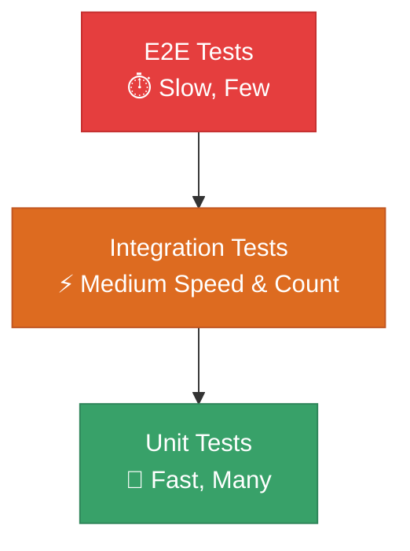

# 🧪 Testing in Node.js

## Chapter 12: Introduction to Testing

---

## 📋 Why Testing Matters

> **"Code without tests is broken by design"** - Jacob Kaplan-Moss

### Key Benefits

- ✅ **Confidence** - Deploy with assurance
- 🐛 **Bug Prevention** - Catch issues early
- 📚 **Documentation** - Tests show how code works
- 🔄 **Refactoring Safety** - Change code fearlessly
- 🚀 **Faster Development** - Long-term time savings

---

## 🎯 Testing Pyramid



---

## 📦 Node.js Built-in Test Runner

### Why Use Node's Test Runner?

- ✨ **No Dependencies** - Built into Node.js (v18+)
- 🚀 **Fast** - Native performance
- 🎯 **Modern** - ESM support, async/await
- 🛠️ **Simple** - Easy to learn and use
- 📊 **Good Reporting** - TAP and spec reporters

```javascript
// No npm install needed!
import { test, describe } from 'node:test';
import assert from 'node:assert';
```

---

## 🆚 Test Runner Comparison

| Feature | Node Test | Jest | Mocha | AVA |
|---------|-----------|------|-------|-----|
| Built-in | ✅ | ❌ | ❌ | ❌ |
| Speed | 🚀🚀🚀 | 🚀🚀 | 🚀🚀 | 🚀🚀🚀 |
| Mocking | ✅ | ✅ | ➕ | ➕ |
| Parallel | ✅ | ✅ | ➕ | ✅ |
| Coverage | ✅ | ✅ | ➕ | ➕ |

➕ = Requires additional packages

---

## 🎓 What We'll Cover

1. **Writing Tests** - Basics of test structure
2. **Assertions** - Validating results
3. **Async Testing** - Testing promises and async code
4. **Mocking** - Isolating code under test
5. **Code Coverage** - Measuring test effectiveness
6. **Best Practices** - Professional testing patterns

---

## 📚 Resources

- [Node.js Test Runner Docs](https://nodejs.org/api/test.html)
- [Node.js Testing Best Practices](https://github.com/goldbergyoni/nodejs-testing-best-practices)
- [Assert Module Docs](https://nodejs.org/api/assert.html)

---

[🏠 Home](../README.md) | [Next: Writing Your First Test →](./02-first-test.md)
